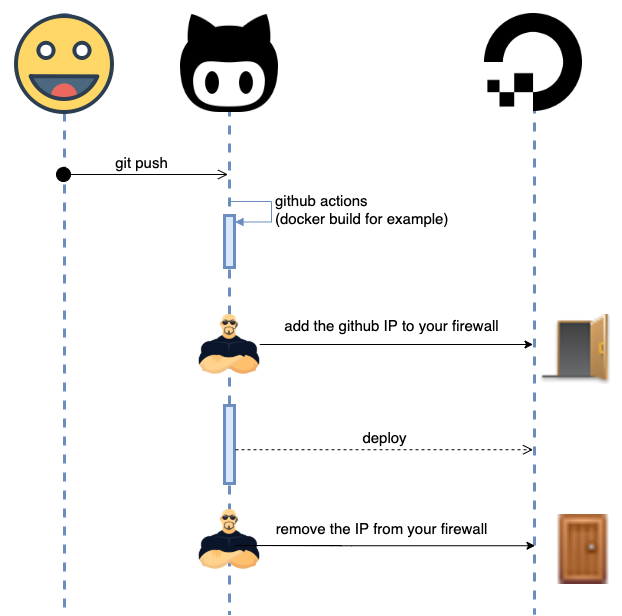
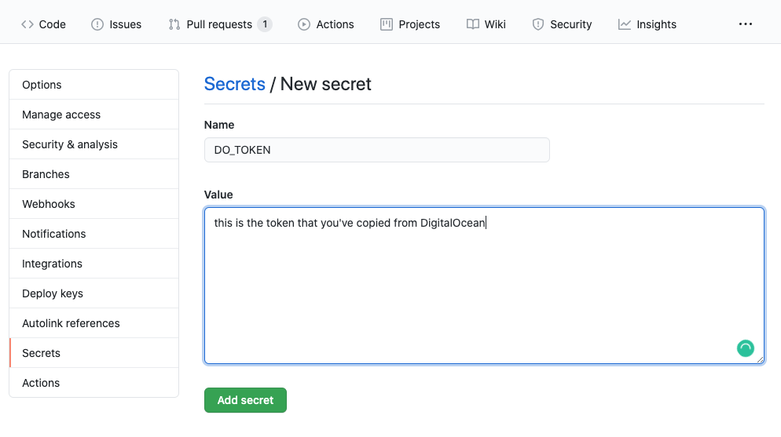

Doorkeeper DigitalOcean Action
==============================

This Github action allows you to open or close an specific port in your DigitalOcean firewall.
It's really useful for deploy in your instances from Github Actions, as [they don't provide a list of IPs to add to your security groups](https://help.github.com/en/actions/reference/virtual-environments-for-github-hosted-runners#ip-addresses-of-github-hosted-runners).




Usage
-----
You need to generate a **personal access token** from [your DigitalOcean Applications & API](https://cloud.digitalocean.com/account/api/tokens) page.


Copy that token, and paste in the secrets of your repo:


Create or update a workflow, adding the file `.github/workflows/doorkeeper.yml` ([more info about how to use Github Actions](https://help.github.com/en/actions/getting-started-with-github-actions/starting-with-preconfigured-workflow-templates)).


```yaml

############################
## prepare your artifacts ##
############################

- name: Doorkeeper open
  uses: patoroco/doorkeeper@master
  with:
    digitaloceanToken: ${{ secrets.DO_TOKEN }}
    firewallName: "name_of_the_firewall"
    actionToDo: "add"
    dryRun: false

############################
## deploy to DigitalOcean ##
############################

- name: Doorkeeper close
  uses: patoroco/doorkeeper@master
  with:
    digitaloceanToken: ${{ secrets.DO_TOKEN }}
    firewallName: "name_of_the_firewall"
    actionToDo: "remove"
    dryRun: false
```

To check that everything is working as expected, you have to push these changes to your repo, and a new build in the `Actions` tab should be starting.


Development
-----------
First of all, you have to install the dependencies:

```bash
npm install
```

I've been using [act](https://github.com/nektos/act) to test the action in local, and it's really useful because it doesn't require to push anything to github. After install it, you can do:

```bash
npm run local:action
```

You can also run the code itself using:

```bash
npm run local
```

LICENSE
-------

- [MIT License](LICENSE.md).
- The Doorman Icon was [downloaded from Vecteezy](https://www.vecteezy.com/free-vector/doorman).
